A written form of my New Zealand Skeptics 2023 conference talk "Open Data and Closed Minds. Contested interpretations of public data" in which I am a little wordier than the spoken live form.

## Intro

New Zealand likes data. 

New Zealand likes data a lot.

For many years I’ve been involved in discussing public data around topics of the day, and in 2017, back when Twitter was useful, I did a little analysis of how much political parties from around the anglosphere were referring to data and evidence in their Tweets and documents linked to their Tweets.

**Graph showing rate of use of terms 'Data' and 'Evidence' by political parties of different countries. NZ has an order of magnitude higher rate**

New Zealand Political parties used the term data and or evidence at far higher rates than parties in the UK, the USA, or Australia. And while people can argue about the degree to which that is rhetorical, none the less New Zealand had very high expectations of showing your evidence when making an argument. 

And this story also serves as an introduction of sorts- prior to covid I was interacting both with all kinds of public data, and all kinds of people interested in what that data had to say – for example interested members of the public, domain experts, and journalists.

## Enter Covid

And then we get to the Covid Era. Which from a data perspective saw unparalleled cooperation and collaboration between academics, journalists, health officials, and the general public. Of all of those categories, the one I fit best in is the general public. Because my explaining and summarising public data was purely an out of work activity even though I like to think it was to a professional standard (and statisticians in subject matter experts largely seemed to feel the same way about it).

I found some claims that, in the years just before covid, New Zealand had both a world leading number of Epidemiologists and Science Communicators per capita. So in an normal member of the public kind of way I was initially, like everyone else, following what was said and the public data.

## A remote, sparsely populated island

What first drew me into directly summarising covid data was to make clear the evidence around New Zealand’s eradication of covid. Because many pedants can quibble around the exact usage of eradicate, I want to take a moment to make clear I mean that all of the covid within the country was killed off and we were all going to mass sporting events and concerts without risk of infection. There was no covid spread inside the country. This means I am not including in community cases the many people who contracted covid overseas, flew to New Zealand, and had their covid infectious period in quarantine without infecting anyone else.

After New Zealand eradicated covid from within the country, there was some feeling expressed among people overseas that it was inevitable that covid could not gain a foothold because of being a remote, sparsely populated island. 

This popular perception was exacerbated by Chief Officers of Health in other countries, when asked about how come New Zealand could get rid of covid and their countries couldn’t, saying things along the lines of  “covid behaved differently in New Zealand”. Placing the locus of the outcome on the nature of covid rather than the response of the people.

Qualitatively, we know that we live in houses and work in workplaces like everyone else, so it spreads like everywhere else, rather than our being spread out evenly across the country in our own 50,000 square metre spaces.

**Map showing uninhabited parts of New Zealand. By Andrew Douglas-Clifford Creative Commons Attribution-NonCommercial-ShareAlike 4.0 International License.**

*Map source: https://www.andrewdc.co.nz/wp-content/uploads/2018/11/Nobody-Lives-Here-NZ-web.png (link)*

However, when people saw the well known “Nobody lives here” map by Andrew Douglas-Clifford, people offshore could easily interpret it as “see all the emptiness” while local people were far more likely to understand it as “see how the population is concentrated together”.

Quantitatively, what was very successful, and was my first covid related data sharing, was making it clear New Zealand had known community spread like other places, and it was the speed and comprehensiveness of our actions that changed the outcomes.

**Graph showing the initial (known reported, so able to be acted on) spread of covid between selected countries**

*Data source: OurWorldInData https://github.com/owid/covid-19-data/tree/master/public/data (link)*

If you line countries reported cases up against the date of the 100th new case (so covid was established in the community and being officially measured) most countries, including New Zealand, followed  very similar track. Then New Zealand rapidly went into level 4 lockdown. The infections just before lockdown provided a little more growth momentum for a short while, but they did not spread like before. And covid, trapped by people in their homes, died away.

## Evidence of Absence is not absence of evidence

While New Zealanders were going about their lives in 2020, covid denialism was becoming organised (though a minority view) overseas- claims like covid was just a flu, and that PCR testing could not be used to detect covid. A number of people claiming this have subsequently gone on to be vaccine denialists.

While these arguments didn’t much directly touch New Zealand, New Zealand data could directly counter fictional claims like 97% of the time PCR tests would produce false positives.

Covid denialists, ignoring both what PCR was patented to do and the 35 years of scientific development since then, claimed a 97% false positive rate- So the chance of having 3 negative tests in a row when there really was no covid was 27 (3 times 3 times 3) in a million (100 times 100 times 100).

Remember how New Zealand eradicated covid from the community? Over the winter of 2020 there were 102 days when there were no new cases inside the country. But in those 102 days there were over half a million tests done looking for covid, as everyone with the slightest cold symptoms did the right thing and went and got themselves tested. You can’t get half a million negative tests in a row if a negative person is 97% likely to be a false positive. You aren't even likely to have 3 in a row.

*Data source: Community cases are available from the https://github.com/minhealthnz/nz-covid-data cases/covid-case-counts.csv file if cases occuring "At the border" are excluded. For test numbers, use the wayback machine to look up total tests on various dates to calculate the number between*

New Zealand’s results in not having false positives were considerably better than the manufacturers guarantees. But there are a few things to keep in mind about that- manufactures set their promised performance levels at a very conservative level which will easily be met so there are no liability issues.

But also, if you read the kind of things that can be false positives, and I urge everyone to read widely when thinking about data, most of the ways testing can be a false positive requires some presence of covid. Getting two people’s samples swapped around in a clerical error produces a false positive and a false negative for different people, but someone’s sample was still a genuine positive test. A negative sample getting contaminated with covid in the lab to make a false positive for that person was still a correct test, it is just the attribution of the source of the covid is false. These kinds of false positives just can’t occur when there is no covid anywhere nearby.

And this reflects a special value of New Zealand data in this period- testing claims in the absence of covid.

## Absence of Evidence  is not Evidence of Absence

But there are places, where due to the early overall success against covid, that in itself created gaps in the data. For some people, the symptoms of covid did not just go away with time. What is now called long covid. Because New Zealand had very little covid, it had very little wider awareness or attention to the consequences of covid. Until 2022 that is. Then people got interested.

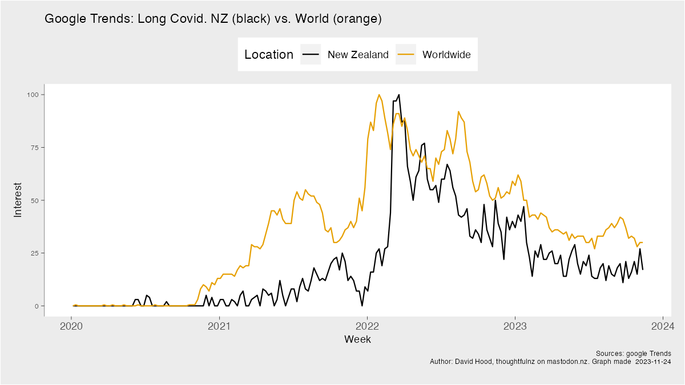

**Graph showing Google Trends interest in the topic Long Covid, for NZ vs. the World**

*Data source: Google Trends data from https://trends.google.com/trends/ (link)*

While New Zealand may have been able to contribute boutique specialist data about covid spread only measurable in tightly controlled settings and the nature of an absence of covid, I think it should also have learnt more, sooner, about what widespread covid means from the many places with it. Because ultimately we have come to share that experience.

## Final Destination models of mortality

After New Zealand had been preventing deaths for a while, there was a a bunch of commentary that New Zealand was just putting off the inevitable- “What were we going to do, be closed up forever” and various aspersions on our imaginary masculinity as nation. Part of this was the idea that our efforts were futile since we would eventually, even if closed, have an inevitable catch-up of delayed deaths. What I call the “Final Destination Movies” model of mortality. I should probably add I have never actually seen a Final Destination Movie, so it might be fairer to describe it as my impression of the vibe of the movie advertising- That if you skip an appointment with death, then death will come to claim you.

But that criticism of futility contains within it an assumption that you can’t learn or improve. That vaccines protective of death and serious outcome can’t be developed. That in fighting the worst respiratory epidemic in a century you can’t get better at dealing with respiratory diseases in general.

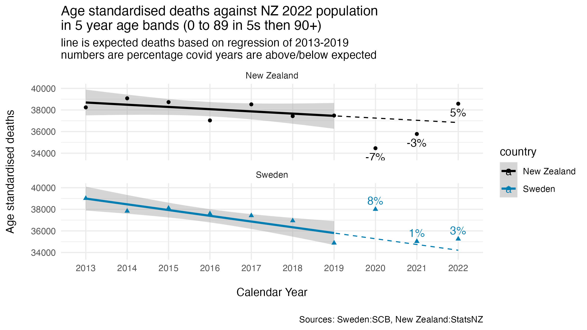

**Graphs showing the change from normal mortality trends in 2020 to 2022**

*Data sources: For Sweden, https://www.scb.se/en/finding-statistics/statistics-by-subject-area/population/population-composition/population-statistics/ get the death rates by 5 year age groups. For NZ https://infoshare.stats.govt.nz get the death rates by 5 year age groups. Then match those death rates to a single standard population to get one overall figure. Sweden weekly mortality data is not used as it lacks 3-5% of the annual deaths*

And while the discussion of how you measure mortality is yet to come. I will say, to me, we have shown agency over our own fates, we did not see the losses of other countries, and we have held onto some of the health gains beyond normal that we made.

## Denominator Wars

In 2021, when New Zealand began vaccinating, How many people had we vaccinated became a really important question.  Since Epidemics flow through the cracks in society, how well covered were we? A question where you need to know the population. But there were three New Zealand populations.

This is, by the way, not an example of anyone trying to be deliberately misleading, just a story about how the best of intentions can cause confusion.

One population were the Stats NZ estimates of the number of the number of people. Relatively easy to get good estimates of at a national level even in non-census years, as it is basically current population minus deaths, plus births, minus emigration, plus immigration. And New Zealand is an archipelago country, so there is not a lot of missed immigration and emigration. It is a more complex problem to estimate where inside the country people are compared to nationally.

Another population is the Ministry of Health HSU (Health Service User) population. This is the population of everyone who has had contact with the health service.  This measure has detailed demographic information associated, and their local General Practitioner gives a pretty accurate location. However, it is not everyone in the country- particularly excluding shorter term visitors. And that starts to matter when considering the resistance to infection vaccines provided against the variants of 2021 and the potential unvaccinated pathways of spread.

And then there was the United Nations population of New Zealand. Since 2006 the United Nations population estimate (based on projections) of New Zealand had varied from the Stats NZ. By 2020 the United Nations estimates were more than 5% below the StatsNZ one. This both meant that international based analysts of NZ vaccination coverage, who tended to draw on the U.N. data, were wild overestimates, and also that it made for some fun population per capita graphs.

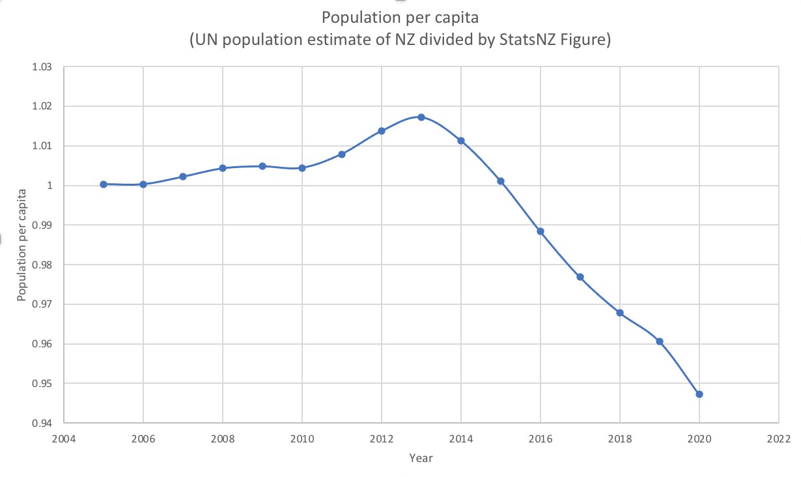

**Graph of Population per Capital (UN population as at 2021 vs Stats NZ)**

*Data sources: Because the UN population numbers were fixed, this was the numbers from the UN as at early 2021 (The Stats NZ population has not changed)*

Fixing the U.N. population data took someone in an official capacity contacting the U.N. with up to date data. And I think for the awareness in getting their we need to specially mention the campaigning of the journalist Henry Cooke who strongly pushed the issue.
And the UN data was fixed.

The HSU vs full population data resulted in what I will describe as Stats NZ having words with the Ministry of Health about the calculation it was using. And if anyone wants to read the review it is at https://www.stats.govt.nz/reports/review-of-health-service-user-population-methodology/

So well it all got sorted in the end. It did mean that for a while through the covid period, people acting in good faith were getting different numbers.

This is not to say there were not lots of political arguments around vaccination levels. Particularly at what I will describe as the stage of people expressing “Everyone I personally know is vaccinated, why should we wait for other people”. But the data denominators were sorted.

## More excess than the Roman Empire.

New Zealand was one of several countries with widespread vaccination when covid was negligible, then widespread covid. With possibly the most vaccine optimised population at time of first nationwide spread of covid.  So it is untenable from an anti-vax perspective that New Zealand be highly successful at having people not die. That means vaccines are safe and effective.

So pretty-much all the current anti-vaxer commentary, in one way or another about New Zealand, hinges on misrepresenting deaths. There is a little talking about levels of hospitalisation be vaccine status, but just keep in mind that, as of when I worked it out in March, the average age of a double boosted New Zealander was 67.8 years old, and the average age of an unvaxed New Zealander was 18.9 years old. And ask yourself how often normally do 19 year olds get hospitalised for infections.

But just like when thinking about hospitalisations versus hospitalisations by age, there are different ways of measuring deaths.

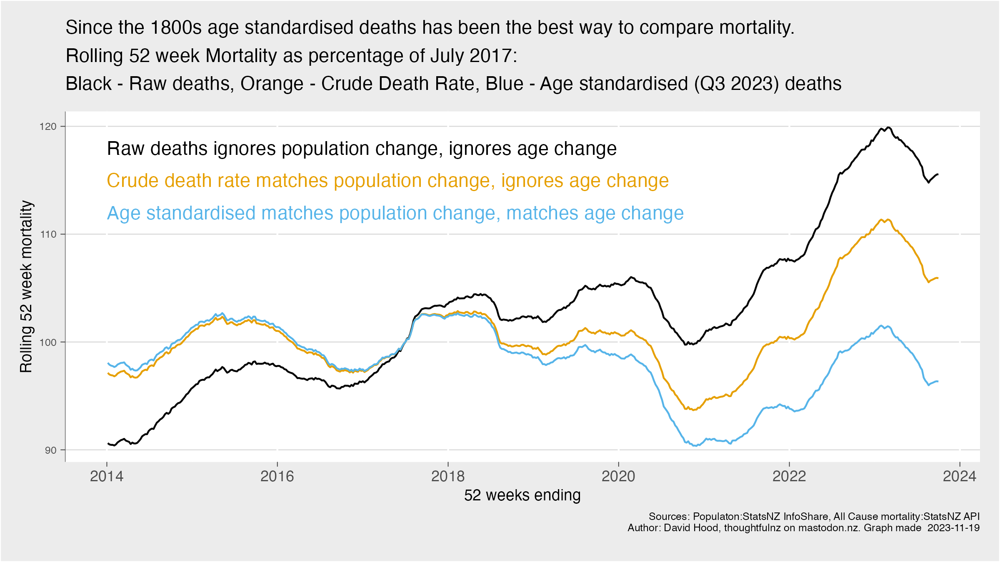

**New Zealand deaths, crude death rate, and age standardised death rate**

*Data sources: NZ weekly deaths by age from https://www.stats.govt.nz/experimental/covid-19-data-portal matched to quarterly population by age from https://infoshare.stats.govt.nz for those measure for which population and age are relevant*

You can just count deaths, ignoring how many living people there are to die. That is the black line which shows a steady upward drift then a steeper uphill climb in recent years. The advantage of ignoring living people is that it can be used to compare with countries that do not regularly count living people. The disadvantage is that in ignoring population and aging changes, it misleads.

You can use the crude death rate, dividing the total number of deaths by the total population. The orange line on this graph. Here it goes along, has a bit of a dip and a bigger rise. While the crude death rate is better than just looking at deaths, if there are big changes in the number of people in age groups in a short time, it misleads. But it does work for countries that only measure their total deaths and total population.

And then, the most accurate method of all, comparing death rates for people of the same age. This has been considered best practice since the 1800s. Have a look at the section “Adjusted death-rate a better means of comparison” in the 1890 Statistical Handbook of New Zealand if you want to read some 133 year old instructions. But, basically, you take the death rates for all your age groups, and apply those rates to one single population to see how many people would have died had the population had the same size for each age group. This is called the standard population for age standardised deaths.

And on this graph, it is the blue line. A big dip, then return to normal, then another dip. While this is the most accurate way of learning anything about how deadly different times and/or places were, it does depend on record keeping accurate enough to be publishing deaths and population by age groups. Which is only about 50 countries in the world.

You might notice that the big divergence between deaths, along with death rates, compared to age standardised death rates happened in the last 5 years or so. This is because both the number of people aged 60 to 80, and the number of people 80 plus have increased by more than 20% in the last few years, leading to it looking like there are a lot more deaths (but not for age standardised). 

While antivaxers have claimed this is impossible and the official population is being faked since immigration can’t explain that, the extra people arrived in New Zealand in the late 1950s. The ten pound pom scheme saw the mass subsidised importing of Europe’s baby boom on top of our own, so for example the number of 10 to 14 year olds increased by 33% between the 1956 and 1961 census. This is the least surprising demographic change in history with population bulge spending 60 years naturally aging to the point where being old, they began to have a strong effect on deaths.

But you don’t get mislead about that if you use age standardised death rates.
Though that is only half of “excess”. Once you have decided on how you are measuring deaths (people should use age standardised deaths if the data exists) you need to define what “normal” is that is the basis for comparison.

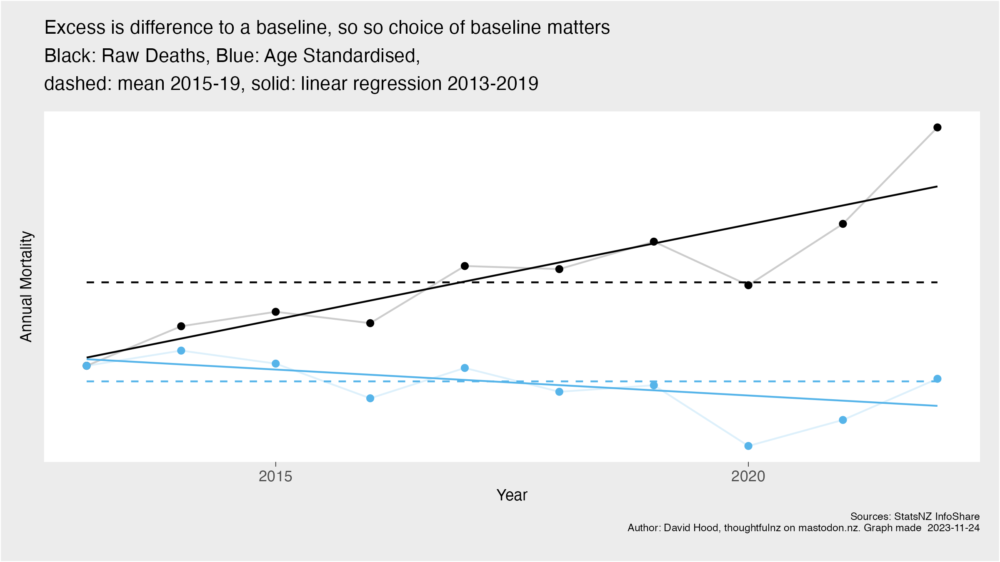

**New Zealand raw deaths & age standardised death rate, with fixed and trend line baselines**

*Data sources: NZ weekly deaths by age from https://www.stats.govt.nz/experimental/covid-19-data-portal matched to quarterly population by age from https://infoshare.stats.govt.nz for those measure for which population and age are relevant*

There tend to be two ways of defining a baseline. Picking a year, or following a trend. 
In picking a year, you choose a year and express how much you way of measuring mortality has changed since then. Often people call this difference an excess, negative or positive. But this measure depends on what the starting point is like. Starting from a year with really high rates of death a normal year looks like a dramatic drop, and starting from a year with a very low death rate a normal year looks like a disaster. So having a fixed year baseline can produce very distorted results.

Following a trend is considered best practice, because it provides the best estimate across multiple years. In New Zealand’s case, the pre-pandemic years of 2013-2019 provide a good straight line trend without systematic error creeping in. If you want a quick check on how good is a mortality measure, move all the indicators 3 years into the past and see how accurate it is at predicting 2017-2019 rather than 2020-2022.

Which brings us to this graph, a dashed fixed point with raw deaths and age standardised deaths, and a solid trend line for raw deaths and age standardised. If you pick the most misleading set of numbers (comparing change over time in raw deaths to when the country was smaller and younger) then there are 9,155 more deaths by the end of 2022. But we know this is wrong because the best fitting model (comparing years to the age standardised trend, and we know it fits best if you check how it preforms with other years) there are 1,680 fewer deaths by the end of 2022. If the excess in raw deaths goes away when you use an age standardised trend line, your excess was not real, it was caused by not using an age standardised trend line and will be some combination of more living people and more old people. More living old people is not a failure.

## The Dip

Special mention needs to be made of the dip in mortality, when using properly age standardised measures, for 2020 to 2021. When deaths went up 8% on trend in countries like Sweden in 2020, New Zealand went down by 7%.

**the same New Zealand and Sweden mortality graph as earlier**

*Data sources: Same as earlier*

Those who were in New Zealand in 2020 might remember next to nobody getting sick, and very few people getting sick in 2021. This was because when every stays home for longer than the reproductive lifespan of infectious diseases, and there is quarantine at the border for longer than the life cycle of infectious diseases, many infectious diseases (not just covid) die out from the country until they are reintroduced. So the death rate drops, rather than just not rising had we only stopped covid. And when we opened back up to the world those diseases came back.
 
The reason it is so important to understand this dip exists, and was a freakishly low period for mortality when we wiped out all kinds of normally present viruses, is that a number of antivaxxer arguments are based on presenting 2020 as a normal year with a rise since then. 2020 was a remarkable saving of lives, with a return to normal since then. 
We know that there was a massive reduction in viruses then reintroduction, because the ESR coordinates monitoring for viruses, and produces annual reports of the virus landscape of New Zealand. 

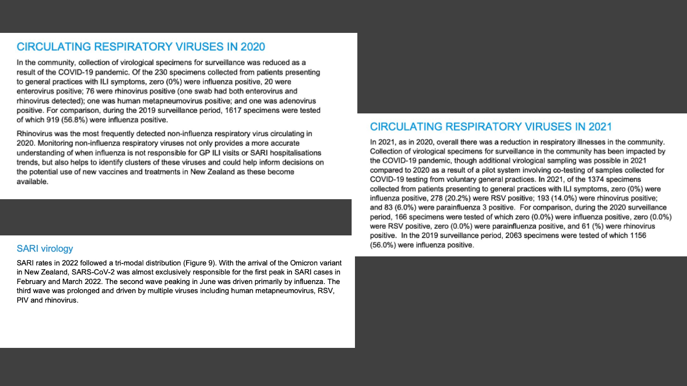

**Sections on general viruses prevalence in NZ from the ESR influenza tracking reports**

*Data sources: The ESR includes general information about all serious virus prevalence in their annual flu tracking reports, available from https://www.esr.cri.nz/our-research/nga-kete/infectious-disease-intelligence/influenza-and-respiratory-surveillance/ near the bottom of the page*

## The talk

There is a common pool of resources that antivaxers draw from to construct frightening stories for those vaccine hesitant. So for people who have to reassure people who have be concerned by the claims, here is some guidance.

The O.E.C.D. has a data set that they, in a move very unhelpful for accurate understanding, called “Mortality (by week): Excess deaths by week, 2020-2023”, which seems to show New Zealand at about 14% higher than expected  for this year. There would be much less drama and fear in the world had the O.E.C.D. called this “Change in raw deaths since the average of 2015-2019” because if you read the methodological notes that is what it is. They even have a special note about how fast the elderly have increased in New Zealand.

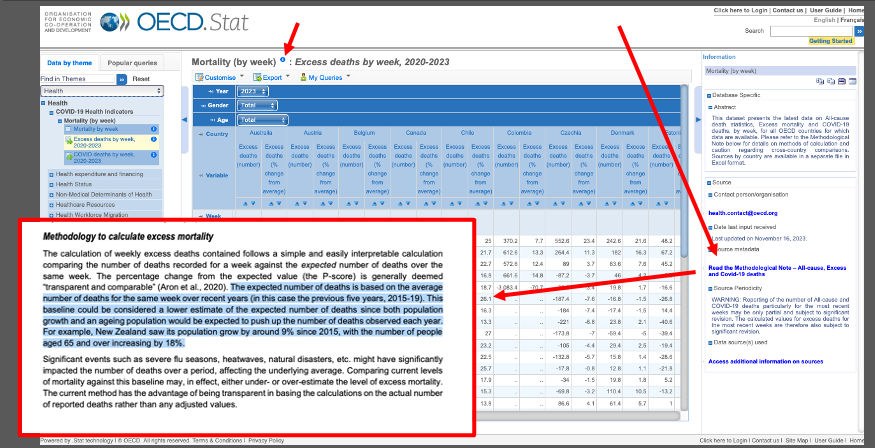

**OECD data set showing how to navigate to method information**

*Data sources: The badly named OECD page is at https://stats.oecd.org/index.aspx?queryid=104676 with the direct link to the method page being https://stats.oecd.org/fileview2.aspx?IDFile=97aacc20-eac4-4e44-8f59-9fb5b7e25090 stating it is the average*

This dataset is graphed in good faith at Our World in Data, who to their credit note the baseline in the title. Antivaxers like to share this graph as for high vaccination countries like New Zealand it looks like there are ongoing more unexplained deaths (actually more living old people). Because this is so common I have prepared a figure that highlights the graph, and shows that while there are more deaths, but for every age group the population has grown so much the death rate is lower for every age group (and you can right click and open separately for full size). Having so many living people with a lower death rate is not a failure.

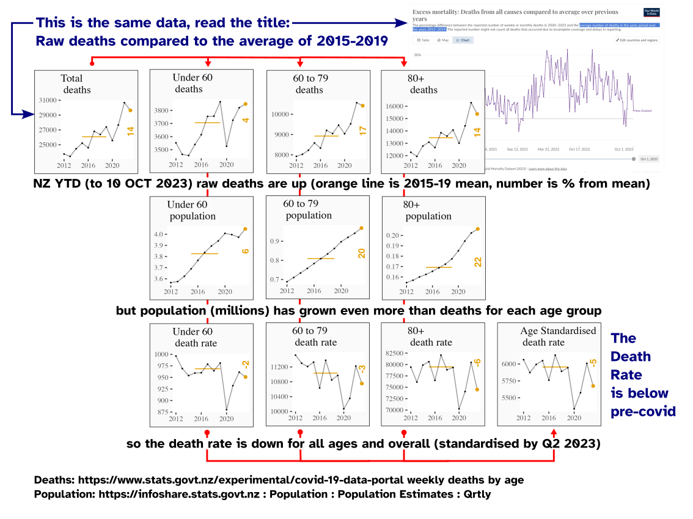

**NZ deaths, population, and death rates**

*Data sources: NZ weekly deaths by age from https://www.stats.govt.nz/experimental/covid-19-data-portal matched to quarterly population by age from https://infoshare.stats.govt.nz for those measure for which population and age are relevant*

Another piece of media antivaxers love to share is the Herald headline “New Zealand records biggest increase in registered deaths in 100 years”. This article could just as easily have been headlined “Death rates return to normal after a 1 in 100 year drop” because it was after the 1 in 100 year drop in deaths in 2020 and the age standardised death rate in 2022 was below 2017. Remember the dip? This is the dip. Again, I am providing the official data as an annotated figure if people you know will benefit from an explanation (and you can right click and open separately for full size). Coming back to normal from a record low mostly just meant extra lives were no longer being saved.

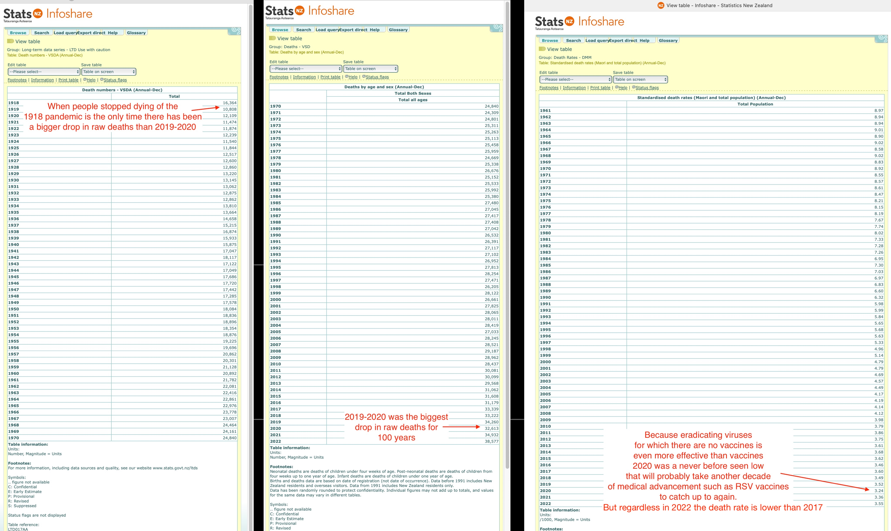

**100 years of deaths, and recent age standardised death rates**

*Data sources: https://infoshare.stats.govt.nz Deaths are from Population - Deaths and LongTerm Data - Deaths, Age standardised death rates are from Population - Death Rates*

But both of those are defensive explanations, showing that the scare stories about mass deaths in New Zealand are not true. In reality we should be comparing countries like New Zealand (with no covid, vaccination, then widespread covid) against countries with no vaccination and covid. Bulgaria is the country with lowest levels of vaccination that publishes deaths by age, and this is their essentially unvaccinated under 60 year old death rate compared to the changed seen in the New Zealand death rate. We missed a lot of mass death.

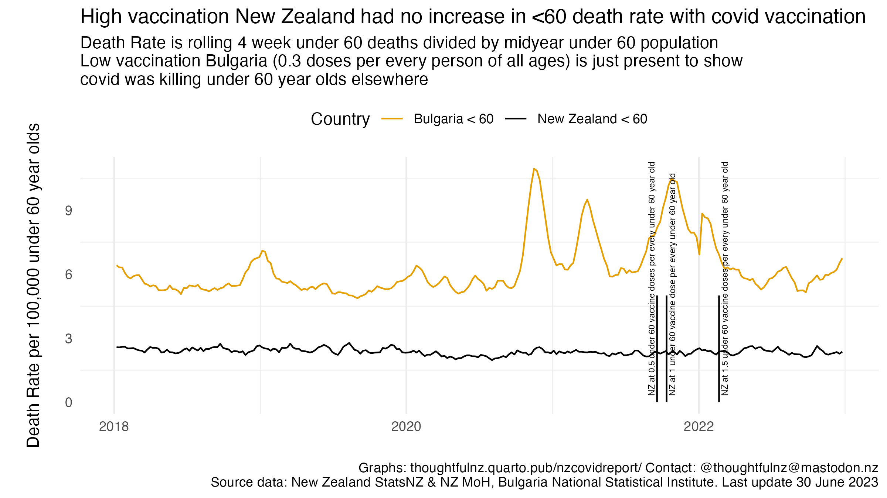

**NZ vs Bulgaria change in death rates in supposed young, healthy age ranges. Bulgaria has vast rises during covid waves**

*Data sources: Same as earlier for NZ, https://infostat.nsi.bg/infostat/pages/module.jsf?x_2=3 for Bulgarian data*

There is another antivaxxer story I believe, from people talking to me, we might be hearing soon. While I personally haven’t seen it yet I suspect it will be based around misrepresenting the idea that when you have 90,000 to 120,000 people vaccinated on a single day, then older people continue to die of natural causes at normal rates. And after a couple of year you can cherry pick enough medical records to say a number of people vaccinated on that day have died, just like a number who bought lotto tickets from the same outlet have died. 100 years from now everyone vaccinated in 2021 will be dead. That will not be unusual.

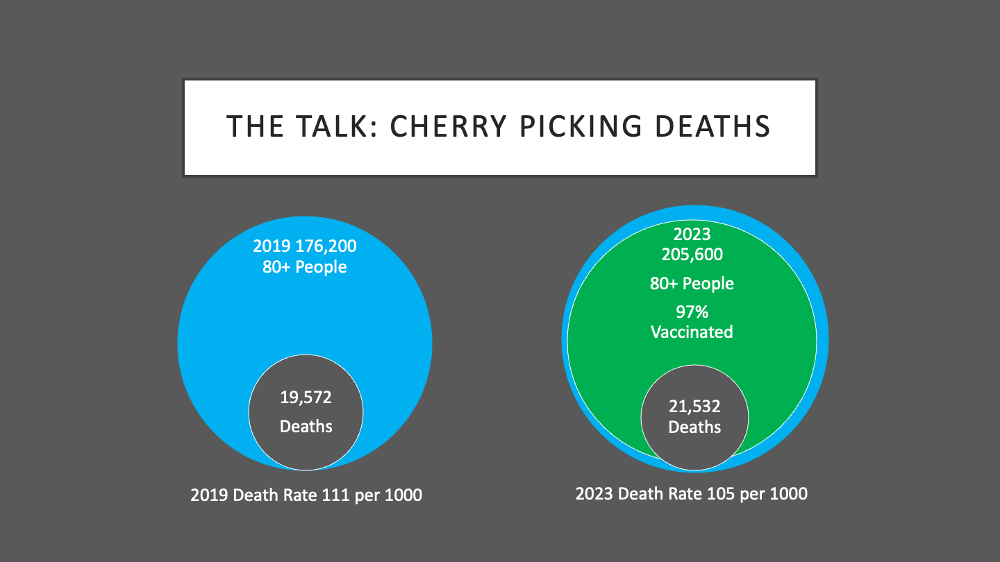

**We all die eventually, but if the death rate is lower then we are living longer**

*Data sources: Vaccination numbers from https://www.tewhatuora.govt.nz/our-health-system/data-and-statistics/covid-vaccine-data/ for general age specific rates*

