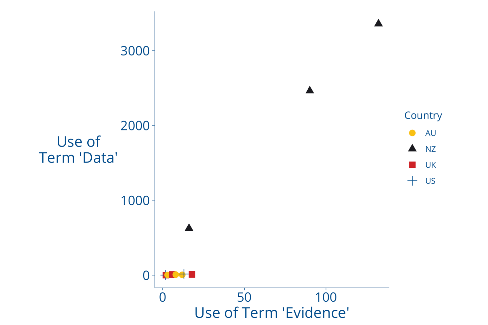
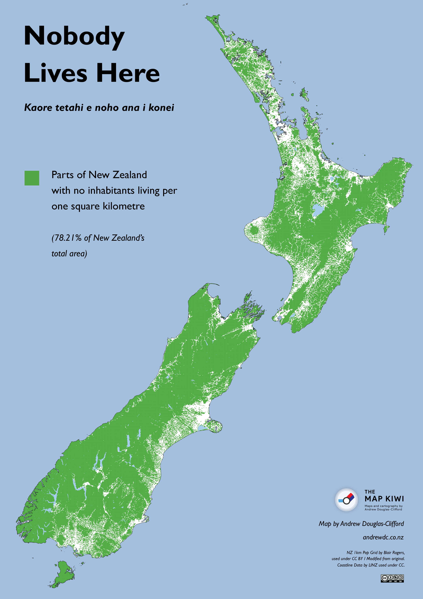
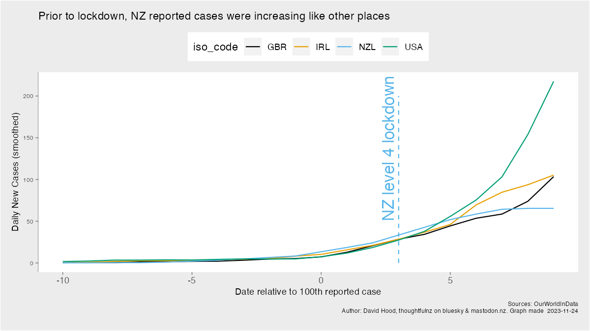

A written form of my New Zealand Skeptics 2023 conference talk "Open Data and Closed Minds. Contested interpretations of public data"

## Intro

New Zealand likes data. 

New Zealand likes data a lot.

For many years I’ve been involved in discussing public data around topics of the day, and in 2017, back when Twitter was useful, I did a little analysis of how much political parties from around the anglosphere were referring to data and evidence in their Tweets and documents linked to their Tweets.

**Graph showing rate of use of terms 'Data' and 'Evidence' by political parties of different countries. NZ has an order of magnitude higher rate**

New Zealand Political parties used the term data and or evidence at far higher rates than parties in the UK, the USA, or Australia. And while people can argue about the degree to which that is rhetorical, none the less New Zealand had very high expectations of showing your evidence when making an argument. 

And this story also serves as an introduction of sorts- prior to covid I was interacting both with all kinds of public data, and all kinds of people interested in what that data had to say – for example interested members of the public, domain experts, and journalists.

## Enter Covid

And then we get to the Covid Era. Which from a data perspective saw unparalleled cooperation and collaboration between academics, journalists, health officials, and the general public. Of all of those categories, the one I fit best in is the general public. Because my explaining and summarising public data was purely an out of work activity even though I like to think it was to a professional standard (and statisticians in subject matter experts largely seemed to feel the same way about it).

I found some claims that, in the years just before covid, New Zealand had both a world leading number of Epidemiologists and Science Communicators per capita. So in an normal member of the public kind of way I was initially, like everyone else, following what was said and the public data.

## A remote, sparsely populated island

What first drew me into directly summarising covid data was to make clear the evidence around New Zealand’s eradication of covid. Because many pedants can quibble around the exact usage of eradicate, I want to take a moment to make clear I mean that all of the covid within the country was killed off and we were all going to mass sporting events and concerts without risk of infection. There was no covid spread inside the country. This means I am not including in community cases the many people who contracted covid overseas, flew to New Zealand, and had their covid infectious period in quarantine without infecting anyone else.

After New Zealand eradicated covid from within the country, there was some feeling expressed among people overseas that it was inevitable that covid could not gain a foothold because of being a remote, sparsely populated island. 

This popular perception was exacerbated by Chief Officers of Health in other countries, when asked about how come New Zealand could get rid of covid and their countries couldn’t, saying things along the lines of  “covid behaved differently in New Zealand”. Placing the locus of the outcome on the nature of covid rather than the response of the people.

Qualitatively, we know that we live in houses and work in workplaces like everyone else, so it spreads like everywhere else, rather than our being spread out evenly across the country in our own 50,000 square metre spaces.

**Map showing uninhabited parts of New Zealand. By Andrew Douglas-Clifford Creative Commons Attribution-NonCommercial-ShareAlike 4.0 International License.**

*Map source: https://www.andrewdc.co.nz/wp-content/uploads/2018/11/Nobody-Lives-Here-NZ-web.png (link)*

However, when people saw the well known “Nobody lives here” map by Andrew Douglas-Clifford, people offshore could easily interpret it as “see all the emptiness” while local people were far more likely to understand it as “see how the population is concentrated together”.

Quantitatively, what was very successful, and was my first covid related data sharing, was making it clear New Zealand had known community spread like other places, and it was the speed and comprehensiveness of our actions that changed the outcomes.

**Graph showing the initial (known reported, so able to be acted on) spread of covid between selected countries**

*Data source: OurWorldInData https://github.com/owid/covid-19-data/tree/master/public/data (link)*

If you line countries reported cases up against the date of the 100th new case (so covid was established in the community and being officially measured) most countries, including New Zealand, followed  very similar track. Then New Zealand rapidly went into level 4 lockdown. The infections just before lockdown provided a little more growth momentum for a short while, but they did not spread like before. And covid, trapped by people in their homes, died away.

(more to be added)
